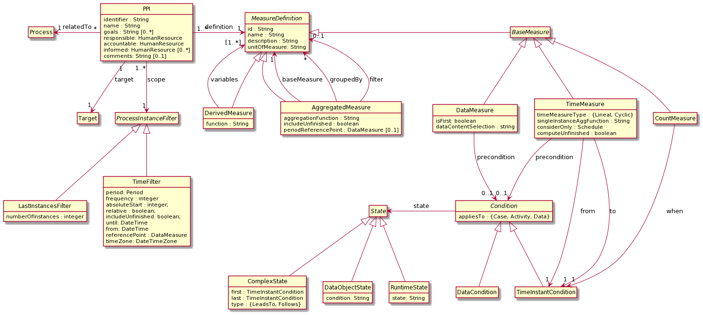

PPINOT
======

[](https://travis-ci.org/isa-group/ppinot)

A key aspect in any process-oriented organisation is the measurement of process performance for the achievement of its
strategic and operational goals. Process Performance Indicators (PPIs) are a key asset to carry out this evaluation,
and, therefore, the management of these PPIs throughout the whole BP lifecycle is crucial.

PPINOT is a set of libraries aimed at facilitating and automating the PPI management. The support includes their
definition using either a [graphical](https://github.com/isa-group/ppinot-visual) or a template-based textual notation, their [automated analysis at design-time](https://github.com/isa-group/ppinot-ontology), and
their automated computation based on processing an event log.

This library provides a Java implementation of the PPINOT metamodel, which is detailed in http://www.isa.us.es/ppinot.
This metamodel provides a foundation on which an automated support for these activities can be built. It identifies the
concepts that are necessary for defining Process Performance Indicators (PPIs) such as the different types of measures
that can be used to compute the PPI value. It was defined to address the challenge of providing PPI definitions that
are unambiguous and complete, traceable to the business process elements used in their definition, independent of the
language used to model business processes (BP) and amenable to automated analysis.

A PPINOT model can be serialized as a JSON file that can be used while implementing REST APIs. `ppinot-model` relies on Jackson to serialize and deserialize from JSON to Java classes.

`ppinot-model` also include the computation of the PPIs based on an event log. The current implementation
supports logs in MXML format and stored in [ElasticSearch](https://github.com/isa-group/ppinot-elasticsearch). However, support to other formats can be easily implemented.

The Java library has been designed to be integrated into custom solutions for process analytics and dashboard design. To this end, it includes features like the ability to read the log from different data sources including databases like ElasticSearch, to load and save a collection of PPI definitions using a JSON format, and to wrap the library in a REST API that can be used in a microservices architecture. Furthermore, it supports the processing of large event logs that do not fit in memory, either by caching them in disk or by relying on external databases like ElasticSearch.

Instead, if you are interested in using PPINOT for more interactive data analysis and exploration worklfows using tools like Jupyter notebooks, you may want to check [`ppinot4py`](https://github.com/isa-group/ppinot4py), which is an alternative implementation of PPINOT for Python.

Installation
------------

PPINOT libraries are available in Maven central repository. Specifically, you must add the following text to the `pom.xml`
of your project:

```
<dependencies>
    <dependency>
        <groupId>es.us.isa.ppinot</groupId>
        <artifactId>ppinot-model</artifactId>
        <version>2.2</version>
    </dependency>
</dependencies>
```

Use
----------------

The approach to define and compute custom PPIs using `ppinot-model` is as follows. First, the custom PPIs are specified following the PPINOT Metamodel and then, the library use this definition to compute them for an event log that can be provided in different formats. Thus, the user can focus on what PPI she wants to define instead of how to compute it.

Next, we show a code example of how to define and compute a simple PPI. The PPI measures the average time since the moment in which activity `Register FI` started to the moment in which activity `Close FI` finishes, considering only the working hours specified for each month.

```java
public class App {
	
	private static final Schedule WORKINGHOURS = new Schedule(DateTimeConstants.MONDAY, DateTimeConstants.FRIDAY, new LocalTime(8,0), new LocalTime(20,0)); 

	public static void main(String[] args) throws Exception {
		// Log specification		
		LogProvider mxmlLog = new MXMLLog(new FileInputStream(new File("logs/simulation_logs.mxml")), null);
		MeasureEvaluator evaluator = new LogMeasureEvaluator(mxmlLog);		

		// Metric definition
		TimeMeasure duration = new TimeMeasure();
		duration.setFrom(new TimeInstantCondition("Register FI", GenericState.START));
		duration.setTo(new TimeInstantCondition("Close FI", GenericState.END));
		duration.setConsiderOnly(WORKINGHOURS);
		duration.setUnitOfMeasure(TimeUnit.HOURS);
		
		AggregatedMeasure avgDuration = new AggregatedMeasure();
		avgDuration.setBaseMeasure(duration);
		avgDuration.setAggregationFunction(Aggregator.AVG);
		
		// Metric computation
		List<Measure> measures = evaluator.eval(avgDuration, new SimpleTimeFilter(Period.MONTHLY, 1, false));
		
        // Print results
		printMeasures(measures);
	}

	
	public static void printMeasures(List<Measure> measures) {
		for (Measure m: measures) {
        	System.out.println("Value: " + m.getValue());
        	System.out.println("Number of instances: " + m.getInstances().size());
        	System.out.println("Instances: " + m.getInstances());
        	if (m.getMeasureScope() instanceof TemporalMeasureScope) {
        		TemporalMeasureScope tempScope = (TemporalMeasureScope) m.getMeasureScope();
        		System.out.println("Start: " + tempScope.getStart().toString());
        		System.out.println("End: " + tempScope.getEnd().toString());
        	}
        	System.out.println("--");
		}
	}

}
```

A full example of a Java project using PPINOT to compute PPIs can be found at the [`ppinot-example` repo](https://github.com/isa-group/ppinot-example).

Defining metrics
------------------

In PPINOT, PPIs and metrics are defined using the PPINOT metamodel, which allows the definition of PPIs with an emphasis on how the PPI is computed. Next, you can find a summarized view of this model.



It supports three types of measures. `Base Measures` are computed for each case and can be divided into time, count or data measures. `Time Measures` measure the time between two  `TimeInstantConditions`. It supports work schedules and holidays, and mechanisms to handle situations where the `from` and `to` conditions occur several times in the same case by means of `Cyclic` time measures, which consider pairs of occurrences and use an `aggregationFunction` to combine them. `Count Measures` measure the number of times a `TimeInstantCondition` occurs in a case. `Data Measures` are used to obtain the value of a case or event attribute. If the value changes throughout the case, one can specify if we want the first value, last value or the value when a `precondition` is met.  `Aggregated Measures` are used to aggregate the values of a `MeasureDefinition` using an `aggregationFunction` like sum, or average. One can also apply a `filter`, and the result can be `groupedBy` one or more values. Filters and groups are measures themselves. Finally, `Derived Measures` are used to compute a new measure by combining several measures using a `function`. More details about the PPINOT Metamodel can be found [here](https://link.springer.com/article/10.1007/s12599-017-0483-3). 


Maturity
-----------

PPINOT is a mature tool that has been successfully applied in two organizations. In both cases, its role is to compute the PPIs used to monitor the Service Level Agreements (SLAs) of external IT providers. Typical examples are the percentage of incidents solved in time, or the percentage of incidents solved without identifying the root cause. This monitoring was used to find inefficiencies and differences between IT providers, and to check the fulfillment of the SLAs and compute the penalties, if applicable. Therefore, the quality of the PPI measurement was critical to avoid conflicts between organizations. 

From a technical perspective, both deployments followed a microservices architecture and integrated with [Governify](https://github.com/isa-group/governify), which provided a framework to store and analyze the SLAs. To this end, a REST API that wraps the library was implemented so that it can interact with the rest of the services. The event log was provided by a MongoDB server and the PPIs were defined using a JSON file. 

Besides these two projects, PPINOT Computer has been successfully used by students to define and compute PPIs in a process management course for more than six years. It has also been used by other researchers to [add privacy to PPI values](https://github.com/MartinKabierski/privacy-aware-ppinot).


Acknowledgements
----------------
This project has been developed as part of Research Projects ISABEL, SETI, THEOS, TAPAS, COPAS and BELI.
